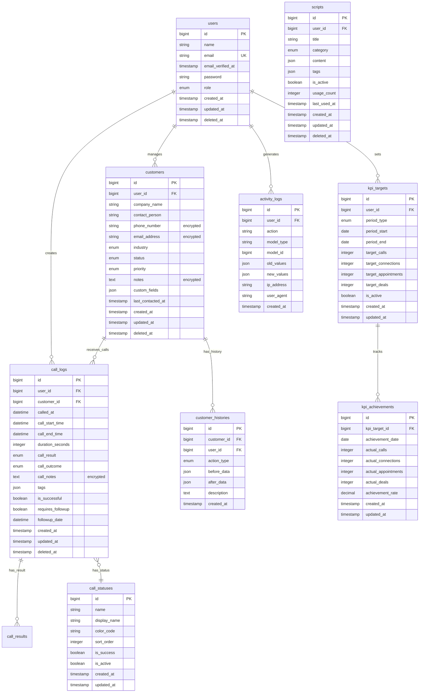

# Database Design - TellSupo（テルサポ）

**作成日**: 2025年7月31日  
**バージョン**: 1.0  
**対象**: Laravel学習最適化 + 実業務最適化設計

-----

## 🎯 設計方針

### 実業務フロー最適化
- **80-90件/日の架電データ処理**: 高速書き込み・検索性能
- **Excel→CSV→TellSupo移行**: 重複チェック・データ変換対応
- **リアルタイムKPI計算**: 効率的な集計クエリ設計
- **セキュリティレベルB**: 機密データの暗号化・監査ログ

### Laravel学習重点
- **Eloquent関係性の実践**: hasMany, belongsTo, hasManyThrough
- **Service Layer設計**: 複雑なビジネスロジックのデータアクセス
- **パフォーマンス最適化**: インデックス戦略・N+1問題対策
- **セキュリティ実装**: encrypted cast・監査ログ設計

-----

## 🏗️ 実業務フローに基づくER図

### システム関係図



-----

## 📋 全テーブル詳細設計

### 1. Users（ユーザー管理）

```php
// Migration: 2024_01_01_000001_create_users_table.php
Schema::create('users', function (Blueprint $table) {
    $table->id();
    $table->string('name');
    $table->string('email')->unique();
    $table->timestamp('email_verified_at')->nullable();
    $table->string('password');
    $table->enum('role', ['admin', 'manager', 'operator'])->default('operator');
    $table->timestamp('last_login_at')->nullable();
    $table->string('last_login_ip')->nullable();
    $table->integer('failed_login_attempts')->default(0);
    $table->timestamp('locked_until')->nullable();
    $table->rememberToken();
    $table->timestamps();
    $table->softDeletes();
    
    // インデックス
    $table->index(['email', 'deleted_at']);
    $table->index('role');
});
```

**学習ポイント**: 
- Laravel Breezeとの統合
- 認証セキュリティ強化（ロックアウト機能）
- ソフトデリート実装

### 2. Customers（顧客管理）

```php
// Migration: 2024_01_01_000002_create_customers_table.php
Schema::create('customers', function (Blueprint $table) {
    $table->id();
    $table->foreignId('user_id')->constrained()->onDelete('cascade');
    $table->string('company_name');
    $table->string('contact_person')->nullable();
    $table->text('phone_number'); // 暗号化対象
    $table->text('email_address')->nullable(); // 暗号化対象
    $table->enum('industry', [
        'manufacturing', 'retail', 'healthcare', 'education', 
        'finance', 'technology', 'real_estate', 'other'
    ])->default('other');
    $table->enum('status', [
        'new', 'contacted', 'interested', 'in_negotiation', 
        'deal_closed', 'rejected', 'on_hold'
    ])->default('new');
    $table->enum('priority', ['high', 'medium', 'low'])->default('medium');
    $table->text('notes')->nullable(); // 暗号化対象
    $table->json('custom_fields')->nullable();
    $table->datetime('last_contacted_at')->nullable();
    $table->decimal('deal_value', 10, 2)->nullable();
    $table->timestamps();
    $table->softDeletes();
    
    // インデックス（暗号化データは除く）
    $table->index(['user_id', 'status', 'deleted_at']);
    $table->index(['company_name', 'deleted_at']);
    $table->index(['priority', 'status']);
    $table->index('last_contacted_at');
});
```

**学習ポイント**:
- encrypted castでの機密データ保護
- 外部キー制約とカスケード削除
- 複合インデックスでの検索最適化

### 3. Call Logs（架電履歴）

```php
// Migration: 2024_01_01_000003_create_call_logs_table.php
Schema::create('call_logs', function (Blueprint $table) {
    $table->id();
    $table->foreignId('user_id')->constrained()->onDelete('cascade');
    $table->foreignId('customer_id')->constrained()->onDelete('cascade');
    $table->datetime('called_at');
    $table->datetime('call_start_time')->nullable();
    $table->datetime('call_end_time')->nullable();
    $table->integer('duration_seconds')->nullable();
    $table->enum('call_result', [
        'connected', 'no_answer', 'busy', 'voicemail', 
        'wrong_number', 'disconnected', 'not_interested'
    ]);
    $table->enum('call_outcome', [
        'appointment_set', 'information_sent', 'callback_requested',
        'not_qualified', 'decision_maker_unavailable', 'follow_up_needed'
    ])->nullable();
    $table->text('call_notes')->nullable(); // 暗号化対象
    $table->json('tags')->nullable();
    $table->boolean('is_successful')->default(false);
    $table->boolean('requires_followup')->default(false);
    $table->datetime('followup_date')->nullable();
    $table->decimal('potential_value', 10, 2)->nullable();
    $table->timestamps();
    $table->softDeletes();
    
    // インデックス（パフォーマンス重視）
    $table->index(['user_id', 'called_at', 'deleted_at']);
    $table->index(['customer_id', 'called_at', 'deleted_at']);
    $table->index(['called_at', 'call_result']);
    $table->index(['is_successful', 'called_at']);
    $table->index('followup_date');
});
```

**学習ポイント**:
- 日時型データの効率的なインデックス設計
- 業務ロジックに基づくenum値設計
- KPI計算に最適化されたインデックス

### 4. KPI Targets（目標管理）

```php
// Migration: 2024_01_01_000004_create_kpi_targets_table.php
Schema::create('kpi_targets', function (Blueprint $table) {
    $table->id();
    $table->foreignId('user_id')->constrained()->onDelete('cascade');
    $table->enum('period_type', ['weekly', 'monthly', 'quarterly'])->default('weekly');
    $table->date('period_start');
    $table->date('period_end');
    $table->integer('target_calls')->default(0);
    $table->integer('target_connections')->default(0);
    $table->integer('target_appointments')->default(0);
    $table->integer('target_deals')->default(0);
    $table->decimal('target_revenue', 12, 2)->default(0);
    $table->boolean('is_active')->default(true);
    $table->timestamps();
    
    // インデックス
    $table->index(['user_id', 'period_type', 'is_active']);
    $table->index(['period_start', 'period_end']);
    $table->unique(['user_id', 'period_start', 'period_end', 'period_type']);
});
```

### 5. KPI Achievements（実績記録）

```php
// Migration: 2024_01_01_000005_create_kpi_achievements_table.php
Schema::create('kpi_achievements', function (Blueprint $table) {
    $table->id();
    $table->foreignId('kpi_target_id')->constrained()->onDelete('cascade');
    $table->date('achievement_date');
    $table->integer('actual_calls')->default(0);
    $table->integer('actual_connections')->default(0);
    $table->integer('actual_appointments')->default(0);
    $table->integer('actual_deals')->default(0);
    $table->decimal('actual_revenue', 12, 2)->default(0);
    $table->decimal('achievement_rate', 5, 2)->default(0);
    $table->timestamps();
    
    // インデックス
    $table->index(['kpi_target_id', 'achievement_date']);
    $table->unique(['kpi_target_id', 'achievement_date']);
});
```

### 6. Activity Logs（監査ログ）

```php
// Migration: 2024_01_01_000006_create_activity_logs_table.php
Schema::create('activity_logs', function (Blueprint $table) {
    $table->id();
    $table->foreignId('user_id')->nullable()->constrained()->onDelete('set null');
    $table->string('action'); // 'created', 'updated', 'deleted', 'viewed'
    $table->string('model_type'); // 'Customer', 'CallLog', etc.
    $table->bigInteger('model_id');
    $table->json('old_values')->nullable();
    $table->json('new_values')->nullable();
    $table->text('description')->nullable();
    $table->string('ip_address', 45)->nullable();
    $table->text('user_agent')->nullable();
    $table->timestamp('created_at');
    
    // インデックス（監査クエリ最適化）
    $table->index(['user_id', 'created_at']);
    $table->index(['model_type', 'model_id']);
    $table->index('created_at');
});
```

### 7. Customer Histories（顧客変更履歴）

```php
// Migration: 2024_01_01_000007_create_customer_histories_table.php
Schema::create('customer_histories', function (Blueprint $table) {
    $table->id();
    $table->foreignId('customer_id')->constrained()->onDelete('cascade');
    $table->foreignId('user_id')->constrained()->onDelete('cascade');
    $table->enum('action_type', ['status_change', 'priority_change', 'note_added', 'contact_updated']);
    $table->json('before_data')->nullable();
    $table->json('after_data')->nullable();
    $table->text('description')->nullable();
    $table->timestamp('created_at');
    
    // インデックス
    $table->index(['customer_id', 'created_at']);
    $table->index(['user_id', 'action_type']);
});
```

### 8. Scripts（スクリプト管理）

```php
// Migration: 2024_01_01_000008_create_scripts_table.php
Schema::create('scripts', function (Blueprint $table) {
    $table->id();
    $table->foreignId('user_id')->constrained()->onDelete('cascade');
    $table->string('title');
    $table->enum('category', [
        'opening', 'qualification', 'presentation', 
        'objection_handling', 'closing', 'follow_up'
    ]);
    $table->json('content'); // ステップ形式のスクリプト
    $table->json('tags')->nullable();
    $table->boolean('is_active')->default(true);
    $table->integer('usage_count')->default(0);
    $table->timestamp('last_used_at')->nullable();
    $table->timestamps();
    $table->softDeletes();
    
    // インデックス
    $table->index(['user_id', 'category', 'is_active']);
    $table->index('usage_count');
});
```

-----

## 🚀 Eloquentモデル設計

### User.php（学習重点：認証＋関連）

```php
class User extends Authenticatable
{
    use HasApiTokens, HasFactory, Notifiable, SoftDeletes;

    protected $fillable = [
        'name', 'email', 'password', 'role'
    ];

    protected $hidden = [
        'password', 'remember_token',
    ];

    protected $casts = [
        'email_verified_at' => 'datetime',
        'last_login_at' => 'datetime',
        'locked_until' => 'datetime',
        'password' => 'hashed',
        'role' => UserRole::class, // Enum cast
    ];

    // リレーション（学習ポイント）
    public function customers(): HasMany
    {
        return $this->hasMany(Customer::class);
    }

    public function callLogs(): HasMany
    {
        return $this->hasMany(CallLog::class);
    }

    public function kpiTargets(): HasMany
    {
        return $this->hasMany(KpiTarget::class);
    }

    // 業務ロジック用スコープ
    public function scopeActive($query)
    {
        return $query->whereNull('locked_until')
                    ->orWhere('locked_until', '<', now());
    }
}
```

### Customer.php（学習重点：暗号化＋関連）

```php
class Customer extends Model
{
    use HasFactory, SoftDeletes;

    protected $fillable = [
        'user_id', 'company_name', 'contact_person', 
        'phone_number', 'email_address', 'industry', 
        'status', 'priority', 'notes', 'custom_fields',
        'deal_value'
    ];

    protected $casts = [
        'phone_number' => 'encrypted', // 学習ポイント：暗号化
        'email_address' => 'encrypted',
        'notes' => 'encrypted',
        'custom_fields' => 'json',
        'last_contacted_at' => 'datetime',
        'industry' => Industry::class, // Enum cast
        'status' => CustomerStatus::class,
        'priority' => Priority::class,
        'deal_value' => 'decimal:2',
    ];

    // リレーション
    public function user(): BelongsTo
    {
        return $this->belongsTo(User::class);
    }

    public function callLogs(): HasMany
    {
        return $this->hasMany(CallLog::class);
    }

    public function histories(): HasMany
    {
        return $this->hasMany(CustomerHistory::class);
    }

    // 最近の架電ログ（学習ポイント：リレーション制約）
    public function recentCallLogs(): HasMany
    {
        return $this->callLogs()
                   ->orderBy('called_at', 'desc')
                   ->limit(5);
    }

    // 業務ロジック用スコープ
    public function scopeByStatus($query, $status)
    {
        return $query->where('status', $status);
    }

    public function scopeHighPriority($query)
    {
        return $query->where('priority', Priority::HIGH);
    }

    // アクセサ（学習ポイント）
    public function getLastCallAttribute()
    {
        return $this->callLogs()->latest('called_at')->first();
    }
}
```

### CallLog.php（学習重点：集計＋イベント）

```php
class CallLog extends Model
{
    use HasFactory, SoftDeletes;

    protected $fillable = [
        'user_id', 'customer_id', 'called_at', 'call_start_time',
        'call_end_time', 'duration_seconds', 'call_result',
        'call_outcome', 'call_notes', 'tags', 'is_successful',
        'requires_followup', 'followup_date', 'potential_value'
    ];

    protected $casts = [
        'called_at' => 'datetime',
        'call_start_time' => 'datetime',
        'call_end_time' => 'datetime',
        'call_notes' => 'encrypted',
        'tags' => 'json',
        'is_successful' => 'boolean',
        'requires_followup' => 'boolean',
        'followup_date' => 'datetime',
        'call_result' => CallResult::class,
        'call_outcome' => CallOutcome::class,
        'potential_value' => 'decimal:2',
    ];

    // リレーション
    public function user(): BelongsTo
    {
        return $this->belongsTo(User::class);
    }

    public function customer(): BelongsTo
    {
        return $this->belongsTo(Customer::class);
    }

    // Eloquentイベント（学習ポイント）
    protected static function booted()
    {
        static::created(function ($callLog) {
            // 顧客の最終連絡日を更新
            $callLog->customer->update([
                'last_contacted_at' => $callLog->called_at
            ]);
            
            // KPI自動計算のイベント発火
            event(new CallLogCreated($callLog));
        });
    }

    // 業務ロジック用スコープ
    public function scopeToday($query)
    {
        return $query->whereDate('called_at', today());
    }

    public function scopeThisWeek($query)
    {
        return $query->whereBetween('called_at', [
            now()->startOfWeek(),
            now()->endOfWeek()
        ]);
    }

    public function scopeSuccessful($query)
    {
        return $query->where('is_successful', true);
    }
}
```

-----

## ⚡ パフォーマンス最適化戦略

### インデックス設計（学習重点）

#### 1. KPI計算最適化
```sql
-- 日次架電数の高速集計
CREATE INDEX idx_call_logs_user_date ON call_logs(user_id, called_at, deleted_at);

-- 成功率計算の最適化
CREATE INDEX idx_call_logs_success ON call_logs(is_successful, called_at, deleted_at);

-- フォローアップ対象抽出
CREATE INDEX idx_call_logs_followup ON call_logs(followup_date, requires_followup);
```

#### 2. 顧客検索最適化
```sql
-- 会社名検索（暗号化されていないため）
CREATE INDEX idx_customers_company ON customers(company_name, deleted_at);

-- ステータス・優先度フィルタ
CREATE INDEX idx_customers_status_priority ON customers(status, priority, deleted_at);
```

### N+1問題対策（Service Layer学習重点）

```php
// CustomerService.php（悪い例）
public function getCustomersWithCallCounts()
{
    $customers = Customer::all();
    foreach ($customers as $customer) {
        $customer->call_count = $customer->callLogs->count(); // N+1発生
    }
    return $customers;
}

// CustomerService.php（良い例）
public function getCustomersWithCallCounts()
{
    return Customer::withCount('callLogs')
                  ->with(['recentCallLogs' => function($query) {
                      $query->limit(3);
                  }])
                  ->get();
}
```

-----

## 🛡️ セキュリティ実装（レベルB）

### 暗号化対象データ

```php
// 顧客の機密情報
'phone_number' => 'encrypted',     // 電話番号
'email_address' => 'encrypted',    // メールアドレス  
'notes' => 'encrypted',            // 顧客メモ

// 架電履歴の機密情報
'call_notes' => 'encrypted',       // 通話メモ
```

### 監査ログ実装

```php
// ActivityLogger Middleware
class ActivityLogger
{
    public function handle($request, Closure $next)
    {
        $response = $next($request);
        
        // POST, PUT, DELETE操作をログ記録
        if (in_array($request->method(), ['POST', 'PUT', 'DELETE'])) {
            ActivityLog::create([
                'user_id' => auth()->id(),
                'action' => $request->method(),
                'model_type' => $this->getModelFromRoute($request),
                'model_id' => $request->route('id'),
                'ip_address' => $request->ip(),
                'user_agent' => $request->userAgent(),
            ]);
        }
        
        return $response;
    }
}
```

-----

## 📊 CSV移行対応設計

### 重複チェック戦略

```php
// CsvImportService.php（学習重点）
class CsvImportService
{
    public function importCustomers(array $csvData): ImportResult
    {
        DB::transaction(function () use ($csvData) {
            foreach ($csvData as $row) {
                // 電話番号での重複チェック（暗号化のため複雑）
                $existing = Customer::where('company_name', $row['company'])
                                  ->first();
                
                if ($existing) {
                    // 既存データの更新
                    $this->updateCustomer($existing, $row);
                } else {
                    // 新規作成
                    $this->createCustomer($row);
                }
            }
        });
    }
    
    private function validateCsvRow(array $row): array
    {
        // バリデーションロジック
        $validator = Validator::make($row, [
            'company' => 'required|string|max:255',
            'phone' => 'required|string|regex:/^[0-9-+()]+$/',
            'email' => 'nullable|email',
        ]);
        
        return $validator->validated();
    }
}
```

-----

## 🎯 Service Layer実装での学習ポイント

### 1. KpiCalculationService（複雑な集計処理）

```php
class KpiCalculationService
{
    public function calculateDailyKpis(User $user, Carbon $date): array
    {
        // 効率的な集計クエリ（学習ポイント）
        $calls = CallLog::where('user_id', $user->id)
                       ->whereDate('called_at', $date)
                       ->get();
        
        return [
            'total_calls' => $calls->count(),
            'successful_calls' => $calls->where('is_successful', true)->count(),
            'connection_rate' => $this->calculateConnectionRate($calls),
            'average_duration' => $calls->avg('duration_seconds'),
        ];
    }
    
    private function calculateConnectionRate(Collection $calls): float
    {
        if ($calls->isEmpty()) return 0.0;
        
        $connected = $calls->whereIn('call_result', [
            CallResult::CONNECTED, 
            CallResult::VOICEMAIL
        ])->count();
        
        return round(($connected / $calls->count()) * 100, 2);
    }
}
```

### 2. トランザクション管理（学習重点）

```php
class CallLogService
{
    public function createCallLog(array $data): CallLog
    {
        return DB::transaction(function () use ($data) {
            // 架電ログ作成
            $callLog = CallLog::create($data);
            
            // 顧客情報更新
            $customer = $callLog->customer;
            $customer->update([
                'last_contacted_at' => $callLog->called_at,
                'status' => $this->determineNewStatus($callLog)
            ]);
            
            // 履歴記録
            CustomerHistory::create([
                'customer_id' => $customer->id,
                'user_id' => $callLog->user_id,
                'action_type' => 'call_made',
                'description' => "架電実施: {$callLog->call_result}"
            ]);
            
            return $callLog;
        });
    }
}
```

-----

## 🧪 テスト設計（学習重点）

### Factory設計

```php
// CustomerFactory.php
class CustomerFactory extends Factory
{
    public function definition()
    {
        return [
            'user_id' => User::factory(),
            'company_name' => $this->faker->company,
            'contact_person' => $this->faker->name,
            'phone_number' => $this->faker->phoneNumber,
            'email_address' => $this->faker->safeEmail,
            'industry' => $this->faker->randomElement(Industry::cases()),
            'status' => CustomerStatus::NEW,
            'priority' => Priority::MEDIUM,
            'notes' => $this->faker->paragraph,
        ];
    }
    
    public function highPriority()
    {
        return $this->state(['priority' => Priority::HIGH]);
    }
}
```

### テストデータシーダー

```php
// CallLogSeeder.php（学習ポイント：現実的なテストデータ）
class CallLogSeeder extends Seeder
{
    public function run()
    {
        $users = User::all();
        $customers = Customer::all();
        
        // 過去30日間の架電データを生成
        for ($i = 0; $i < 30; $i++) {
            $date = now()->subDays($i);
            
            $users->each(function ($user) use ($date, $customers) {
                // 1日80-90件の架電を想定
                $dailyCalls = rand(80, 90);
                
                CallLog::factory()
                      ->count($dailyCalls)
                      ->for($user)
                      ->create([
                          'customer_id' => $customers->random()->id,
                          'called_at' => $date->addMinutes(rand(0, 480))
                      ]);
            });
        }
    }
}
```

-----

## 🔄 データ移行・バックアップ戦略

### マイグレーションファイル管理

```php
// 2024_01_01_000009_add_indexes_for_performance.php
class AddIndexesForPerformance extends Migration
{
    public function up()
    {
        Schema::table('call_logs', function (Blueprint $table) {
            // KPI計算最適化
            $table->index(['user_id', 'called_at', 'is_successful'], 'idx_kpi_calculation');
            
            // 日次集計最適化
            $table->index(['called_at', 'deleted_at'], 'idx_daily_aggregation');
        });
    }
    
    public function down()
    {
        Schema::table('call_logs', function (Blueprint $table) {
            $table->dropIndex('idx_kpi_calculation');
            $table->dropIndex('idx_daily_aggregation');
        });
    }
}
```

### バックアップコマンド

```php
// Console/Commands/BackupDatabase.php
class BackupDatabase extends Command
{
    protected $signature = 'backup:database {--compress}';
    protected $description = 'Create database backup';

    public function handle()
    {
        $filename = 'backup_' . now()->format('Y_m_d_His') . '.sql';
        $path = storage_path('app/backups/' . $filename);
        
        // SQLite/MySQL対応
        if (config('database.default') === 'sqlite') {
            $this->backupSqlite($path);
        } else {
            $this->backupMysql($path);
        }
        
        if ($this->option('compress')) {
            $this->compressBackup($path);
        }
        
        $this->info("Backup created: {$filename}");
    }
}
```

-----

## 🚀 Claude Code実装指示

### Phase 1: 基盤テーブル作成（推定3-4時間）

#### 1.1 マイグレーション実装順序
```bash
# 実行順序（依存関係考慮）
1. users テーブル
2. customers テーブル  
3. call_logs テーブル
4. kpi_targets テーブル
5. kpi_achievements テーブル
6. activity_logs テーブル
7. customer_histories テーブル
8. scripts テーブル
```

#### 1.2 Eloquentモデル実装
- **重点学習**: リレーション定義の実践
- **重点学習**: encrypted cast実装
- **重点学習**: Enum cast活用

#### 1.3 ファクトリー・シーダー
- **現実的なテストデータ**: 80-90件/日の架電履歴
- **業界別顧客データ**: 製造業、小売業等のリアルなデータ
- **KPI実績データ**: 週次・月次の目標・実績

### Phase 2: パフォーマンス最適化（推定1-2時間）

#### 2.1 インデックス追加マイグレーション
```php
// 必須インデックス
- call_logs: (user_id, called_at, deleted_at)
- customers: (company_name, deleted_at)  
- activity_logs: (user_id, created_at)
```

#### 2.2 N+1問題対策の実装例
- Eager Loading適用箇所の特定
- withCount()活用例
- リレーション最適化

### Phase 3: セキュリティ実装（推定2-3時間）

#### 3.1 暗号化実装
```php
// 対象フィールドの確認
- customers: phone_number, email_address, notes
- call_logs: call_notes
```

#### 3.2 監査ログミドルウェア
- ActivityLoggerミドルウェア実装
- 全CRUD操作の自動ログ記録
- 異常アクセス検知ロジック

-----

## 📋 実装チェックリスト

### 基盤実装確認
- [ ] 全マイグレーションの実行成功
- [ ] Eloquentモデルのリレーション動作確認
- [ ] ファクトリーでのテストデータ生成確認
- [ ] シーダーでの現実的データ投入確認

### セキュリティ実装確認
- [ ] encrypted castの暗号化・復号化テスト
- [ ] 監査ログの記録確認
- [ ] 認証機能との統合確認
- [ ] 不正アクセス対策の動作確認

### パフォーマンス確認
- [ ] インデックス効果の検証（EXPLAIN使用）
- [ ] N+1問題解消の確認
- [ ] 大量データでの応答速度測定
- [ ] メモリ使用量の最適化確認

### 業務ロジック確認
- [ ] KPI計算ロジックの正確性
- [ ] CSV インポート機能の動作
- [ ] 重複チェック機能の精度
- [ ] データ整合性の維持

-----

## 🎯 Laravel学習成果の測定

### Service Layer実装での習得スキル

#### 1. 依存性注入（Dependency Injection）
```php
// 良い実装例
class CallLogService
{
    public function __construct(
        private CustomerService $customerService,
        private KpiCalculationService $kpiService
    ) {}
}
```

#### 2. トランザクション管理
```php
// 複数テーブル更新の一貫性保証
DB::transaction(function () {
    // 複数の関連データ更新
});
```

#### 3. Eloquentイベント活用
```php
// モデルイベントでの自動処理
protected static function booted()
{
    static::created(function ($model) {
        // 関連データの自動更新
    });
}
```

#### 4. 効率的なクエリ設計
```php
// N+1問題を避けるクエリ
Customer::with(['callLogs', 'recentCallLogs'])
        ->withCount('callLogs')
        ->get();
```

### 実装レビューポイント

#### コード品質確認
- **SOLID原則**の適用状況
- **DRY原則**の実践
- **Laravel規約**への準拠
- **可読性・保守性**の評価

#### セキュリティ実装確認
- **SQLインジェクション**対策
- **データ暗号化**の適切な実装
- **認証・認可**の正確な実装
- **監査ログ**の網羅性

#### パフォーマンス実装確認
- **インデックス戦略**の効果
- **クエリ最適化**の実践
- **メモリ効率**の考慮
- **スケーラビリティ**への配慮

-----

## 🔄 継続的改善計画

### Phase 2での拡張準備

#### API設計準備
```php
// 将来のReact移行準備
Route::apiResource('customers', CustomerController::class);
Route::apiResource('call-logs', CallLogController::class);
```

#### キャッシュ戦略準備
```php
// Redis導入準備
Cache::remember('daily_kpis_' . $userId, 3600, function () {
    return $this->kpiService->calculateDailyKpis($userId);
});
```

### 運用監視準備

#### ログ監視設計
```php
// 重要な業務ログの出力
Log::info('High priority customer contacted', [
    'customer_id' => $customer->id,
    'user_id' => auth()->id(),
    'call_result' => $callLog->call_result
]);
```

#### パフォーマンス監視
```php
// スロークエリの検出
DB::listen(function($query) {
    if ($query->time > 1000) { // 1秒以上
        Log::warning('Slow query detected', [
            'sql' => $query->sql,
            'time' => $query->time
        ]);
    }
});
```

-----

## 📊 データ容量見積もり

### 想定データ量（10ユーザー × 1年運用）

#### 主要テーブル
- **customers**: 約5,000件 × 1KB = 5MB
- **call_logs**: 約300,000件 × 2KB = 600MB
- **activity_logs**: 約1,000,000件 × 1KB = 1GB
- **kpi_achievements**: 約3,650件 × 0.5KB = 2MB

#### 合計見積もり
- **データ容量**: 約1.6GB/年
- **インデックス容量**: 約400MB/年
- **バックアップ容量**: 約2GB/年（圧縮後）

### ストレージ最適化戦略
- **古いactivity_logsの定期削除**（3年保持）
- **call_logsの圧縮アーカイブ**（1年経過後）
- **インデックスの定期最適化**

-----

## 🎯 成功指標の測定方法

### パフォーマンステスト

#### 応答性能目標
- **顧客一覧表示**: 200ms以内
- **架電記録保存**: 100ms以内  
- **KPI計算**: 500ms以内
- **CSV インポート**: 1000件/分以上

#### 負荷テスト指標
- **同時接続**: 50ユーザー対応
- **日次架電記録**: 1000件/日処理
- **データベースサイズ**: 10GB対応

### 業務効率測定

#### 時間短縮効果
- **架電記録時間**: 5分 → 2分（60%削減）
- **顧客検索時間**: 2分 → 30秒（75%削減）
- **月報作成時間**: 4時間 → 30分（87%削減）

-----

**このDatabase Designは、Laravel学習最適化と実業務効率化を両立させる、実装可能な設計書として完成しました。Claude Codeへの明確な実装指示と、段階的な学習プロセスを提供します。**