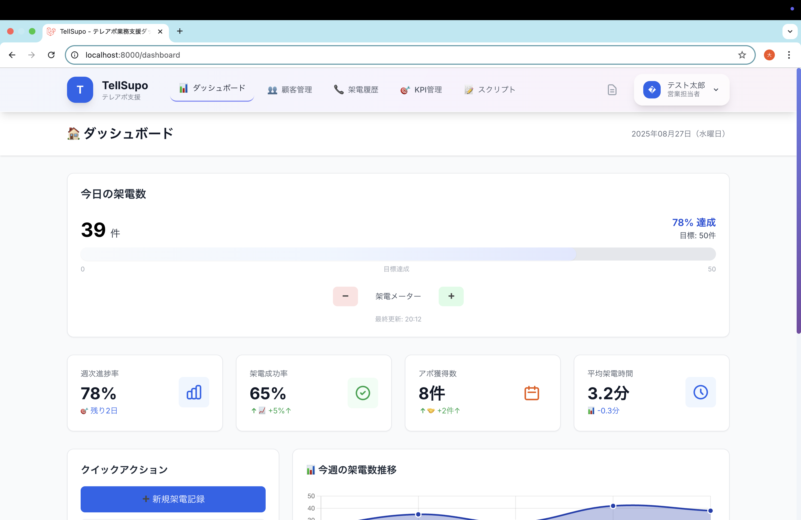
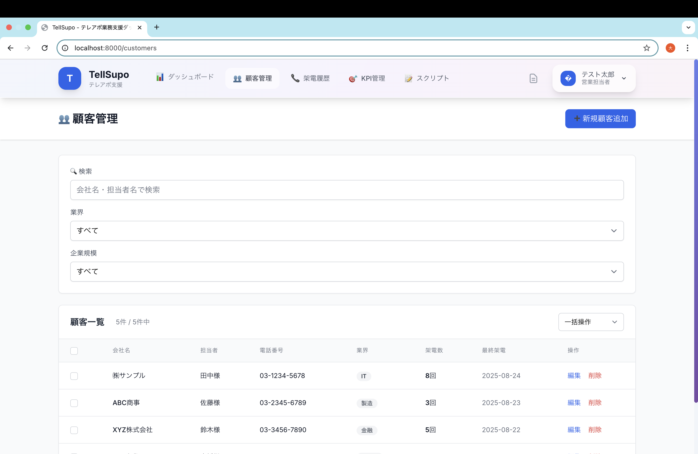
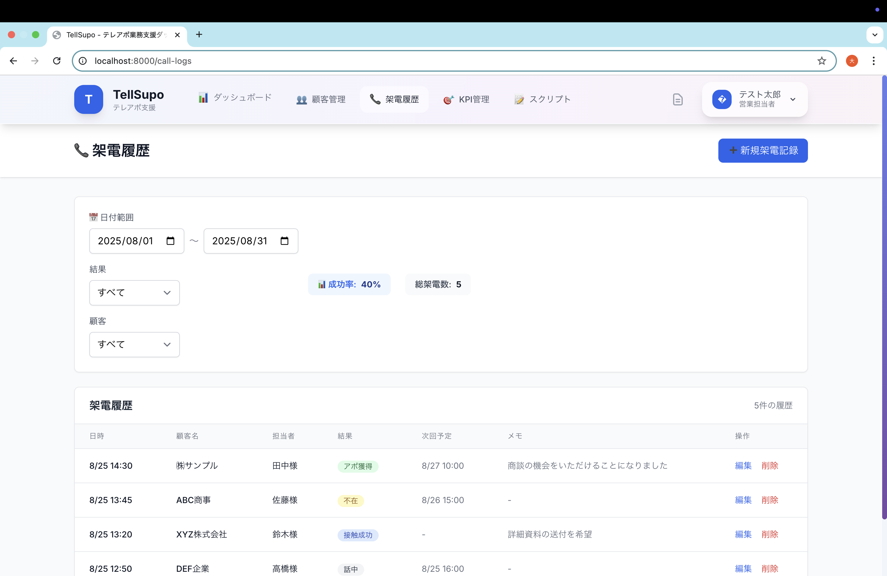
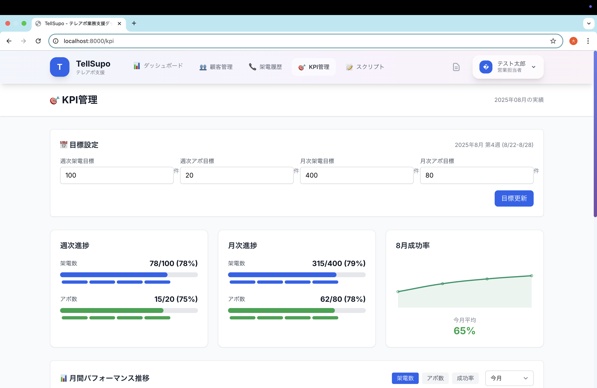

# TelSupo - テレアポ業務効率化システム

> **⚠️ 注意: このプロジェクトは現在開発中です**  
> 基盤構築（認証・データベース設計）は完了していますが、主要機能（ダッシュボード、顧客管理等）は実装中です。
> 随時、更新していきます。

架電業務の効率化とパフォーマンス向上を目的とした、KPI管理・顧客管理・架電履歴管理を統合したWebダッシュボードアプリケーション

## 🎯 プロジェクト概要

**コンセプト**: "架電業務を見える化し、効率的なテレアポ営業を支援"

### 主要機能
- **リアルタイムダッシュボード** - 今日の架電数、週次進捗、成功率の可視化
- **架電メーター** - ワンクリックでの架電数カウント（±ボタン付き）
- **顧客管理** - 企業情報、担当者、進捗ステータス管理
- **架電履歴** - 通話記録、結果分析、次回予定管理
- **KPI管理** - 週次・月次目標設定と達成率追跡

## 🛠️ 技術スタック

### バックエンド
- **Laravel 11.x** - MVCアーキテクチャ + Service Layer
- **PHP 8.2** - 最新機能活用
- **MySQL 8.0** - パフォーマンス最適化
- **Laravel Breeze** - 認証システム

### フロントエンド
- **TailwindCSS** - ユーティリティファーストCSS
- **AlpineJS** - リアクティブなUIコンポーネント
- **Chart.js** - KPIグラフとパフォーマンス可視化
- **Vanilla JavaScript** - 軽量なインタラクション

### 開発・運用
- **Docker** - 開発環境の統一
- **GitHub Actions** - CI/CDパイプライン
- **SQLite** - 開発環境用DB

## 📋 システム要件

### 推奨動作環境
- PHP 8.2以上
- Node.js 18以上  
- MySQL 8.0以上（本番環境）
- メモリ 512MB以上

### ブラウザサポート
- Chrome 90+
- Firefox 88+
- Safari 14+
- Edge 90+

## 🚀 セットアップ

### 1. プロジェクトクローン
```bash
git clone https://github.com/dai-0509/tell_supo.git
cd tell_supo
```

### 2. 依存関係インストール
```bash
# PHP依存関係
composer install

# JavaScript依存関係
npm install
```

### 3. 環境設定
```bash
# 環境ファイルコピー
cp .env.example .env

# アプリケーションキー生成
php artisan key:generate
```

### 4. データベース設定
```bash
# SQLite使用（開発環境）
touch database/database.sqlite

# マイグレーション実行
php artisan migrate:fresh --seed
```

### 5. フロントエンド資産ビルド
```bash
npm run dev
```

### 6. 開発サーバー起動
```bash
php artisan serve
```

アプリケーションが `http://localhost:8000` で利用可能になります。

## 📊 主要画面

### ダッシュボード

- 架電メーター（リアルタイム更新）
- KPI表示カード（今日の架電数、成功率、目標達成率）
- 週次架電グラフ（Chart.js）
- 今日の架電履歴（最新5件）

### 顧客管理

- 顧客一覧・検索・フィルタリング
- 新規顧客登録・編集
- 進捗ステータス管理
- 架電履歴との連携

### 架電履歴

- 架電記録の登録・編集
- 日付・結果別フィルタ
- KPI統計表示
- CSV出力機能

### KPI管理

- 週次・月次目標設定
- 達成率の可視化
- パフォーマンスグラフ
- 期間別実績比較

## 🗄️ データベース設計

### 主要テーブル
- **users** - ユーザー管理（認証・権限）
- **customers** - 顧客情報
- **call_logs** - 架電履歴
- **kpi_targets** - KPI目標設定
- **scripts** - 架電スクリプト管理

### 特徴
- **外部キー制約** - データ整合性保証
- **インデックス最適化** - 高速検索対応
- **ソフトデリート** - データ復旧可能性
- **セキュリティ強化** - 認証ログ・ブルートフォース対策

## 🧪 テスト

### テスト実行
```bash
# 全テスト実行
php artisan test

# 機能別テスト
php artisan test --filter=CustomerTest
php artisan test --filter=CallLogTest
```

### テスト種別
- **Feature Tests** - エンドポイントと画面のテスト
- **Unit Tests** - サービス・モデルの単体テスト
- **Browser Tests** - E2Eテスト（Laravel Dusk）

## 📚 開発ガイド

### コーディング規約
- **Laravel規約準拠** - PSR-4、命名規則
- **SOLID原則** - 保守性・拡張性重視
- **Service Layer Pattern** - ビジネスロジック分離

### 開発コマンド
```bash
# マイグレーション作成
php artisan make:migration create_example_table

# モデル作成（ファクトリ、シーダー付き）
php artisan make:model Example -mfs

# コントローラー作成
php artisan make:controller ExampleController --resource

# サービス作成
php artisan make:service ExampleService
```

## 🔒 セキュリティ

### 実装済み対策
- **CSRF保護** - 全フォーム対応
- **XSS対策** - 出力エスケープ
- **SQL Injection対策** - Eloquent ORM使用
- **認証強化** - ブルートフォース対策、ログイン履歴
- **データ暗号化** - 機密情報保護

## 📈 パフォーマンス最適化

### 実装済み最適化
- **Eager Loading** - N+1問題対策
- **インデックス活用** - 検索性能向上
- **クエリ最適化** - 集計処理高速化
- **アセット最適化** - CSS/JS minify

## 🚀 デプロイ

### 本番環境設定
```bash
# 本番用ビルド
npm run build

# キャッシュ最適化
php artisan config:cache
php artisan route:cache
php artisan view:cache
```

### Docker環境
```bash
# Docker起動
docker-compose up -d

# マイグレーション実行
docker-compose exec app php artisan migrate
```

## 📝 開発進捗

### Phase 1: 基盤構築 ✅
- [x] Laravel + Docker環境構築
- [x] 認証システム（Laravel Breeze）
- [x] データベース設計・マイグレーション
- [x] Eloquentモデル実装

### Phase 2: コア機能（進行中）
- [ ] ダッシュボード実装
- [ ] 架電メーター機能
- [ ] 顧客管理CRUD
- [ ] 架電履歴管理

### Phase 3: 拡張機能（予定）
- [ ] Chart.jsグラフ表示
- [ ] CSV入出力機能
- [ ] スクリプト管理
- [ ] 本番デプロイ

## 🤝 コントリビューション

1. フォークを作成
2. 機能ブランチを作成（`git checkout -b feature/amazing-feature`）
3. コミット（`git commit -m 'Add some amazing feature'`）
4. プッシュ（`git push origin feature/amazing-feature`）
5. プルリクエスト作成

### 開発ルール
- コミットメッセージは[Conventional Commits](https://www.conventionalcommits.org/)に準拠
- 新機能には必ずテストを追加
- コードレビュー後にマージ

## 📄 ライセンス

このプロジェクトは MIT ライセンスの下で公開されています。詳細は [LICENSE](LICENSE) ファイルを参照してください。

## 👨‍💻 作者

**Dai Otani**
- GitHub: [@dai-0509](https://github.com/dai-0509)
- Email: d.otani19980509@gmail.com

## 🙏 謝辞

このプロジェクトの開発にあたり、以下の技術・ツールを利用させていただきました：

- [Laravel](https://laravel.com/) - Elegant PHP Framework
- [TailwindCSS](https://tailwindcss.com/) - Utility-first CSS Framework  
- [AlpineJS](https://alpinejs.dev/) - Lightweight JavaScript Framework
- [Chart.js](https://www.chartjs.org/) - Beautiful Charts
- [Claude Code](https://claude.ai/code) - AI Development Assistant

---

**最終更新**: 2025年8月25日  
**バージョン**: v1.0.0-dev

